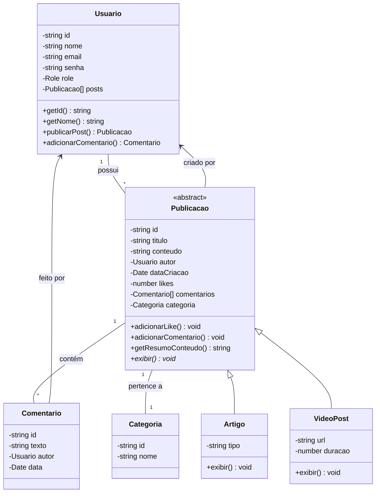

# 📰 Sistema de Gerenciamento de Blog
Este projeto foi desenvolvido como parte das atividades da disciplina da trilha de Front-end Javascript no Módulo 02 (Nivelamento de Lógica de Programação e OO) do programa DiversAbility.

Este é um sistema completo de gerenciamento de blog desenvolvido em TypeScript, seguindo os princípios de Programação Orientada a Objetos (POO).

## ✨ Funcionalidades
- Gerenciamento de usuários com diferentes níveis de permissão (Admin, Editor, Leitor)
- Publicação de artigos e posts de vídeo
- Sistema de comentários e likes
- Categorização de conteúdos
- Serialização para JSON
- Sistema de permissões robusto

## 📊 Diagrama de Classes UML


## 🎨 Decisões de Design

### Encapsulamento
- Utilizei modificadores de acesso (`private`, `protected`) para proteger os dados internos das classes
- Implementei getters para acesso controlado aos atributos
- Métodos setters possuem validações para manter a integridade dos dados
- A coleção de posts retorna uma cópia (`[...this.posts]`) para proteger o encapsulamento

### Herança e Polimorfismo
- Criei uma classe base abstrata `Publicacao` para representar publicações genéricas
- Implementei classes filhas `Artigo` e `VideoPost` que especializam o comportamento
- O sistema pode tratar diferentes tipos de publicação de forma polimórfica
- Método `exibir()` é abstrato na classe base e implementado nas classes filhas

### Composição e Associação
- **Composição** entre `Publicacao` e `Comentario` (um post tem muitos comentários)
- **Associação** entre `Usuario` e `Publicacao` (um usuário pode ter muitos posts)
- **Associação** entre `Publicacao` e `Categoria` (um post pertence a uma categoria)

### Princípios SOLID
- **Single Responsibility**: Cada classe tem uma responsabilidade única e bem definida
- **Open/Closed**: As classes estão abertas para extensão mas fechadas para modificação
- **Liskov Substitution**: As classes filhas podem substituir a classe base sem quebrar o sistema
- **Interface Segregation**: Interfaces específicas para cada tipo de comportamento
- **Dependency Inversion**: Dependências são injetadas via construtores

### Sistema de Permissões
- Implementei um sistema baseado em roles (Admin, Editor, Leitor)
- Validações de permissão são centralizadas nos métodos de negócio
- Apenas administradores podem executar ações privilegiadas

### Serialização
- Todas as classes implementam a interface `Serializavel`
- Métodos `toJSON()` retornam representações adequadas para API
- A serialização mostra apenas dados relevantes para o contexto

### Tratamento de Erros
- Exceções específicas para erros de negócio
- Tratamento adequado de erros do tipo `unknown`
- Mensagens de erro claras e informativas


## 📋 Base da Estrutura de Arquivos
```
blog-system/
├── src/
│   ├── models/
│   │   ├── index.ts
│   │   ├── Usuario.ts
│   │   ├── Publicacao.ts
│   │   ├── Artigo.ts
│   │   ├── VideoPost.ts
│   │   ├── Comentario.ts
│   │   ├── Categoria.ts
│   │   └── types.ts
│   ├── index.ts
│   └── utils.ts
├── package.json
├── tsconfig.json
└── README.md
```

## 🚀 Como Executar
###  Pré-requisitos
- Node.js (versão 14 ou superior)
- npm

###  Instalação e Execução
1. Clone o repositório ou extraia os arquivos
2. Abra o terminal na pasta do projeto
3. Execute os comandos:

```bash
# Instalar dependências
npm  install

# Executar o projeto
npm  start
```
